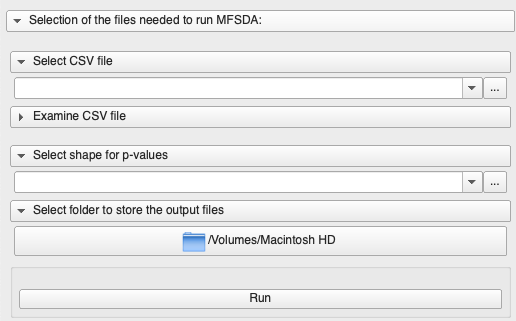
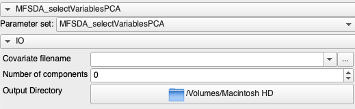

# MFSDA: Multivariate Functional Shape Data Analysis

MFSDA_Python is a Python based package for statistical shape analysis.

A multivariate varying coefficient model is introduced to build the association between the multivariate shape measurements and demographic information and other clinical variables.

Statistical inference, i.e., hypothesis testing, is also included in this package, which can be used in investigating whether some covariates of interest are significantly associated with the shape information.

The hypothesis testing results are further used in clustering based analysis, i.e., significant suregion detection.

## Modules

### Loadable module

The project loadable module allowing MFSDA to invoke the command line module MFSDA_run
and MFSDA_createShapes. More details below. 

### CLI modules

| CLI Name           | Description |
|--------------------|-------------|
| [MFSDA_selectVariablesPCA][MFSDA_selectVariablesPCA] | Variable selection using Correlation with Principal Components. |
| [MFSDA_run][MFSDA_run]                               | Main script to run the Multivariate Funcional Shape Data Analysis |
| [MFSDA_createShapes][MFSDA_createShapes]             | After completion, add the pvalues/efit to a shape for visualization|

[MFSDA_createShapes]: https://github.com/DCBIA-OrthoLab/MFSDA_Python/blob/master/MFSDA/MFSDA_createShapes.xml
[MFSDA_run]: https://github.com/DCBIA-OrthoLab/MFSDA_Python/blob/master/MFSDA/MFSDA_run.xml
[MFSDA_selectVariablesPCA]: https://github.com/DCBIA-OrthoLab/MFSDA_Python/blob/master/MFSDA/Resources/Libraries/MFSDA_selectVariablesPCA.py

#### MFSDA_selectVariablesPCA.py

Helper script for variable selection using pearson correlations with the principal components (PCA).
Runs PCA in the dataset and selects the first 'n' first principal components. 
A correlation analysis is done with each variable in the dataset and the principal components.
This analysis will give you an idea of how correlated each variable is to the first 'n' principal components, in other words, 
how much does each variable contribute to a principal components. Ideally, when running MFSDA, you should select variables 
that are not correlated between each other or select variables that contribute to different principal components. 

##### Required inputs

###### csv

Input table with header row (covariate names). One row per subject. 

###### ouput

Output directory. It will generate a pdf file with the plots and a set of json and csv files with outputs of the analysis, i.e., the percentage of contribution for each variable to the principal component. 

#### MFSDA/MFSDA_run.py

This is the main script of the application to run the Multivariate Functional Shape Data Analysis. 

##### Required inputs

Run the script MFSDA_run.py with flag '-h' or '--help' for more information.

###### shapeData

This is a text file that contains the vtk filenames to the shapes/3D models and the corresponding covariates for each shape. The fields must be separated by ','. The first column must be the filename to the shape. 

###### coordData

This is the template that is used to align the shapes in a common space or spherical mapping. 
Please check [SPHARM-PDM](https://github.com/NIRALUser/SPHARM-PDM)

###### outputDir

Output directory

#### MFSDA/MFSDA_createShapes.py

Once MFSDA is completed, you may add the resulting pvalues/efit coefficients to a shape from your population. 

##### Required inputs

Run the script MFSDA_createShapes.py with flag '-h' or '--help' for more information.

###### shape

Input vtk shape/3D model.

###### pvalues

Resulting pvalues json file from MFSDA_run.

###### efit

Resulting efit json file from MFSDA_run.

###### covariates

Covariate names, ex. '--covariates age gender group var1'. These names are used to add arrays to the .vtk file. You can later visualize them in '3DSlicer' or 'ShapePopulationViewer'

###### output

Output vtk file. 

## License

It is covered by the Apache License, Version 2.0:

http://www.apache.org/licenses/LICENSE-2.0

The license file was added at revision 2aa1467f on 2020-12-10, but you may consider that the license applies to all prior revisions as well.

## History

This project was initially developed in early August 2017 by Chao Huang and Hongtu Zhu from
the [BIG-S2 lab](https://www.med.unc.edu/bigs2/) at the University of North Carolina at Chapel Hill School of Medicine.

Then, between November 2017 and June 2018, [Juan Carlos Prieto][juanprietob] from the School of Dentistry at the University Of Michigan contributed the script for generating shapes with pvalue maps, and [Loic Michoud][loic-michoud],
in the context of internship, contributed the MFSDA Slicer loadable module along with the initial infrastructure to
support distribution as a Slicer extension (developed in an independent branch available [here][support-slicer-extension]).

Then, in November 2018, in the context of an internship at [NIRAL][niral] (Neuro Image Research and Analysis Laboratories)
in the Department of Psychiatry at the University of North Carolina at Chapel Hill School of Medicine,  [Mateo Lopez][lopezmt] further improved the Slicer loadable module by improving the user interface, re-organizing files and renaming the
loadable module from `ShapeDistanceAnalyzer` to `MFSDA`.

Then, in 2019, [Juan Carlos Prieto][juanprietob] from [NIRAL][niral] added the script `MFSDA_selectVariablesPCA.py`
for performing the PCA of a set of variables and doing a correlation analysis with the N principal components.

Later, in 2019-2020, [Beatriz Paniagua][bpaniagua], [Jared Vicory][vicory], [Jean-Christophe Fillion-Robin][jcfr]
and [Sam Horvath][sjh26] from Kitware Inc. worked on improving the user interface and robustness, transitioning
to Python 3.x and revamping the build-system to support distribution as a Slicer extension.

[juanprietob]: https://github.com/juanprietob
[loic-michoud]: https://github.com/loic-michoud
[support-slicer-extension]: https://github.com/loic-michoud/MFSDA_Python/commits/SlicerExtension
[lopezmt]: https://github.com/lopezmt
[niral]: https://www.med.unc.edu/psych/research/niral/people-1/structural-and-dti-analysis-group/
[vicory]: https://github.com/vicory
[sjh26]: https://github.com/sjh26
[jcfr]: https://github.com/jcfr
[bpaniagua]: https://github.com/bpaniagua

